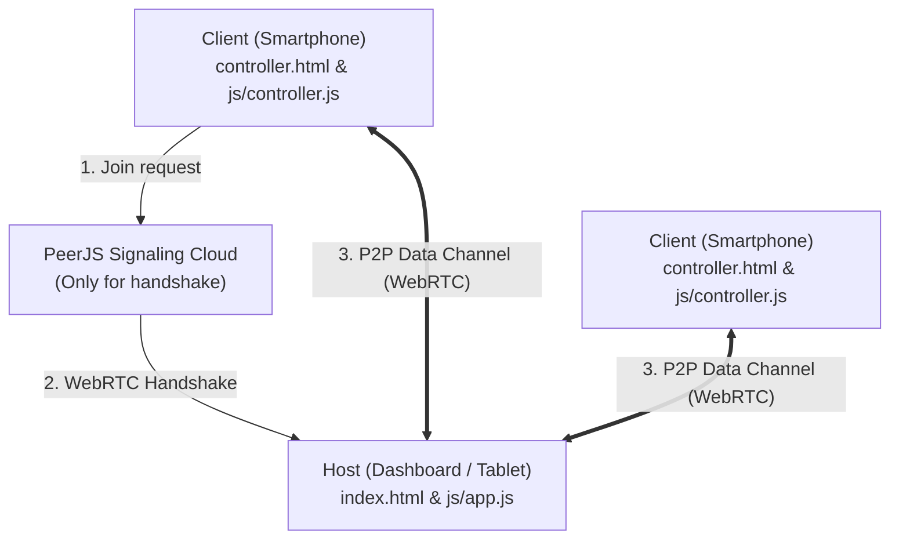

# Architecture

This document describes the design and architecture of **Quintasch**.

## System Topology
Quintasch uses a serverless **Star (Stern) Topology** powered by WebRTC (PeerJS) data channels. There is no central server managing game state; the game state resides fully on the Host (Dashboard) client.

## Component Architecture

- **Host (Dashboard)**:
  - `index.html`: Layout of the game screen, room code, QR code container, 3D dice stage, scoreboard, and logs.
  - `js/app.js`: Orchestrates the PeerJS host peer, parses client messages (joining, rolling), updates game turns, manages localStorage history, and triggers 3D rolls and sound effects.
- **Client (Controller)**:
  - `controller.html`: Interface for inputting room code/name, selecting bets (Pasch, Trasch, Quintasch, etc.), and triggering rolls.
  - `js/controller.js`: Connects to host via PeerJS, handles UI state changes (`yourTurn`, `waitTurn`), validates input, and sends action payloads to the host.
- **Game Engine & Rules**:
  - `js/game.js`: Contains dice combinations, evaluation rules (`evaluateDiceRoll`), and rotation mathematics for the 3D CSS dice.
- **Audio Synthesizer**:
  - `js/audio.js`: Generates procedurally synthesized sound effects (rattle, sweep, chime, buzzer) using browser-native Web Audio API.
- **Progressive Web App (PWA)**:
  - `sw.js`: Service worker containing a Cache-First fetching strategy for offline-first support.
  - `manifest.json`: Metadata for standalone homescreen installation.

## Data Flows

### Game Roll Flow
1. Active Client selects a bet (e.g. "Pasch") and clicks "WÜRFELN!".
2. Client sends a JSON payload `{ type: "rollDice", bet: "pasch" }` to Host.
3. Host receives payload, locks gameplay inputs, plays white noise rattle sound, and performs 3D CSS dice animation.
4. Host calculates results, evaluates outcome via `evaluateDiceRoll(diceValues, bet)`.
5. Host updates score, displays outcome modal, saves to `localStorage`, plays success or failure synth sound, and handles turn transition.
