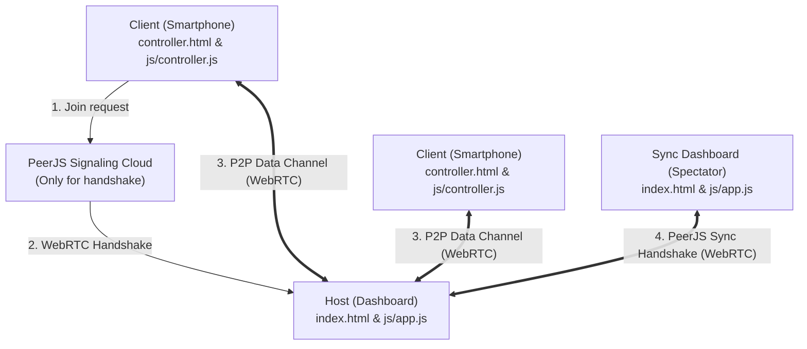

# Architecture

This document describes the design and architecture of **Quintasch**.

## System Topology
Quintasch uses a serverless **Star (Stern) Topology** powered by WebRTC (PeerJS) data channels. There is no central server managing game state; the game state resides fully on the Host (Dashboard) client. Additional spectator dashboards can connect to the Host in 'Sync' mode to mirror the UI, dice animations, history, and timer in real-time, and can also send control commands back to the Host.

## Component Architecture

- **Host (Dashboard)**:
  - `index.html`: Layout of the game screen, landing/start overlay, room code, QR code container, 3D dice stage, scoreboard, and logs.
  - `js/app.js`: Orchestrates the PeerJS host peer or sync peer, parses client and sync messages (joining, rolling, command forwarding), updates game turns, manages localStorage history, and triggers 3D rolls and sound effects.
- **Client (Controller)**:
  - `controller.html`: Interface for inputting room code/name, selecting bets (Pasch, Trasch, Quintasch, etc.), triggering rolls, and displaying a scaled 3D dice animation during active rolls.
  - `js/controller.js`: Connects to host via PeerJS, handles UI state changes (`yourTurn`, `waitTurn`, `rollStart`, `rollResult`), validates input, sends action payloads to the host, drives the mobile 3D dice animation, and manages local sound preferences via localStorage.
- **Game Engine & Rules**:
  - `js/game.js`: Contains dice combinations, evaluation rules (`evaluateDiceRoll`), and rotation mathematics for the 3D CSS dice.
- **Audio Synthesizer**:
  - `js/audio.js`: Generates procedurally synthesized sound effects (rattle, sweep, chime, buzzer) using browser-native Web Audio API.
- **Progressive Web App (PWA)**:
  - `sw.js`: Service worker containing a Cache-First fetching strategy for offline-first support.
  - `manifest.json`: Metadata for standalone homescreen installation.

## Data Flows

### Game Roll Flow
1. Active Client selects a bet (e.g. "Pasch") and clicks "WÜRFELN!".
2. Client sends a JSON payload `{ type: "rollDice", bet: "pasch" }` to Host.
3. Host receives payload, generates dice values, and immediately sends `{ action: "rollStart", dice: [...] }` to the active client's WebRTC connection.
4. Host locks gameplay inputs, plays white noise rattle sound, and performs 3D CSS dice animation (2s cubic-bezier transition).
5. Active Client receives `rollStart`, hides betting form, shows scaled 50px 3D dice, plays optional rattle sound, and animates dice in sync with dashboard using double `requestAnimationFrame`.
6. Host calculates results, evaluates outcome via `evaluateDiceRoll(diceValues, bet)`.
7. Host broadcasts `rollResult` to all clients — active client hides dice table, restores betting form, and displays result overlay.
8. Host updates score, displays outcome modal, saves to `localStorage`, plays success or failure synth sound, and handles turn transition.

### Multi-Dashboard Sync Flow
1. Sync Dashboard connects to Host via PeerJS and sends `{ action: "syncDashboardJoin" }`.
2. Host registers the connection and responds with the current game state payload (players, history, active turn, active timer).
3. Any game state changes (turns, timer changes) or dice rolls trigger a broadcast from Host to all connected Sync Dashboards.
4. UI commands triggered on Sync Dashboards (game start, next turn, roll) are forwarded to Host via `{ action: "syncCommand" }` and processed.

### Host Failover & Client Reconnection Flow
1. Host dashboard disconnects or closes connection.
2. Connected Sync Dashboards detect connection loss, sort active spectator peer IDs, and elect the successor (lowest alphabetical peer ID).
3. The successor dashboard destroys its client peer, waits 1.5 seconds, and promotes itself to Host under the original room ID (keeping existing game state variables).
4. Other sync dashboards wait 4 seconds and reconnect to the original room ID (now hosted by the successor).
5. Mobile clients detect connection loss, display a reconnecting overlay, and perform a loop of up to 5 connection retries (every 2 seconds) to the original room ID.
6. The new Host receives re-joining client requests, updates their connection/peerId, and sends them their current turn state (active or wait) immediately, restoring gameplay.
